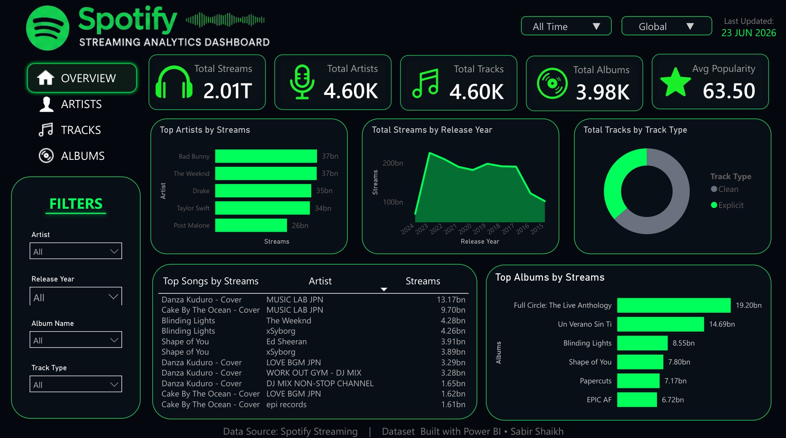

# 🎵 Spotify Streaming Analytics Dashboard

## 📌 Overview

A Spotify-inspired Power BI dashboard designed to analyze music streaming performance, artist popularity, album trends, and track insights through interactive visualizations.

## 🚀 Features

- Interactive Spotify-themed UI
- KPI Cards for key metrics
- Top Artists by Streams
- Streams Trend Analysis
- Track Type Distribution
- Top Songs by Streams
- Top Albums by Streams
- Dynamic Filters & Slicers

## 🛠 Tools Used

- Power BI Desktop
- DAX
- Data Modeling
- Data Visualization

## 📊 Key Metrics

- Total Streams
- Total Artists
- Total Tracks
- Total Albums
- Average Popularity

## 👨‍💻 Author

**Sabir Shaikh**

⭐ If you like this project, consider giving it a star.
